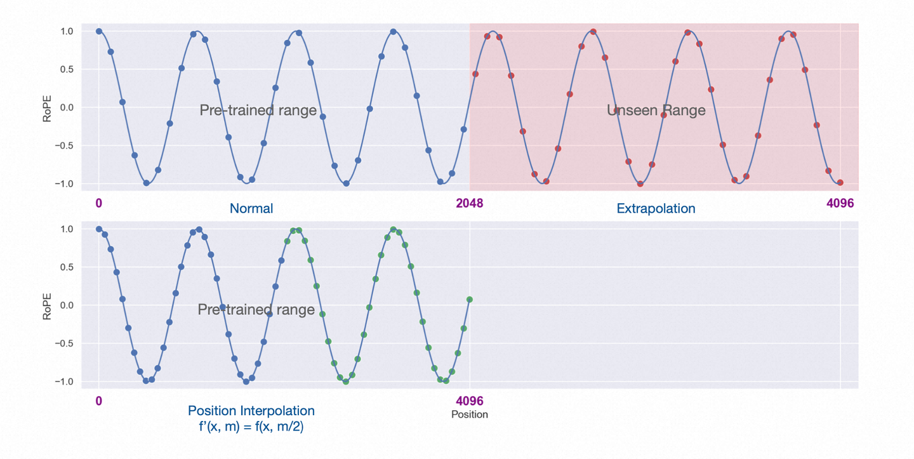

#### Transformer 的 Self Attention Layer 实现

- Transformer 模型的自注意力（Self Attention）机制涉及三种线性变换：查询（Q）、键（K）、值（V），以及通过计算注意力权重和加权求和来生成最终的输出。以下是自注意力机制的公式：

  - 假设输入序列为 $X \in \mathbb{R}^{L \times d}$，其中 $L$ 是序列长度，$d$ 是特征维度。自注意力层中的线性变换矩阵为 $W_q \in \mathbb{R}^{d \times d_k}$、 $W_k \in \mathbb{R}^{d \times d_k}$ 和 $W_v \in \mathbb{R}^{d \times d_v}$，其中 $d_k$ 和 $d_v$ 是分割查询、键和值时的维度。
  - 查询（Q）、键（K）和值（V）的线性变换：

    - $Q=X⋅W_{q}$
    - $K=X⋅W_{k}$
    - $V=X⋅W_{v}$
  - 多头拆分：

    - 在多头自注意力中，将查询（Q）、键（K）和值（V）分成 $h$ 个头，其中 $h$ 是注意力头的数量。对于每个头，使用不同的线性变换权重。
  - 注意力得分计算：

    - 使用查询（Q）和键（K）计算注意力得分，可以使用点积注意力（Scaled Dot-Product Attention）：
      - $Attention(Q,K)=softmax(\frac{QK^{T}}{\sqrt{d_{k}}})$
  - 注意力加权求和：

    - 使用注意力权重对值（V）进行加权求和，得到自注意力的输出：
      - $Output=Attention(Q,K)V$
  - 上述公式涵盖了Transformer模型中自注意力层的基本计算步骤。在实际应用中，通常还会考虑添加缩放（scaling）、掩码（masking）等操作来优化注意力机制的计算过程。多头自注意力则在每个头上分别进行这些计算，然后将多个头的输出拼接或串联起来，进一步提取序列中的信息
- 一个多头 Self Attention 代码实现如下：

```python
import torch
import torch.nn.functional as F

class SelfAttentionLayer(torch.nn.Module):
    def __init__(self, d_model, num_heads):
        super(SelfAttentionLayer, self).__init__()
        self.d_model = d_model
        self.num_heads = num_heads
        self.d_k = d_model // num_heads

        # 线性变换矩阵
        self.W_q = torch.nn.Linear(d_model, d_model, bias=False)
        self.W_k = torch.nn.Linear(d_model, d_model, bias=False)
        self.W_v = torch.nn.Linear(d_model, d_model, bias=False)

    def split_heads(self, x, batch_size):
        x = x.view(batch_size, -1, self.num_heads, self.d_k)
        return x.permute(0, 2, 1, 3)

    def forward(self, x):
        batch_size, seq_len, d_model = x.size()

        q = self.W_q(x)
        k = self.W_k(x)
        v = self.W_v(x)

        q = self.split_heads(q, batch_size)
        k = self.split_heads(k, batch_size)
        v = self.split_heads(v, batch_size)

        # Scaled Dot-Product Attention
        attn_scores = torch.matmul(q, k.transpose(-2, -1)) / (self.d_k ** 0.5)
        attn_weights = F.softmax(attn_scores, dim=-1)

        # Attention加权求和
        output = torch.matmul(attn_weights, v)
        output = output.permute(0, 2, 1, 3).contiguous().view(batch_size, seq_len, -1)

        return output

# 测试自注意力层
d_model = 512
num_heads = 8
seq_len = 10
batch_size = 16

input_data = torch.randn(batch_size, seq_len, d_model)
self_attention = SelfAttentionLayer(d_model, num_heads)
output = self_attention(input_data)
print(output.size())  # 输出: torch.Size([16, 10, 512])
```

#### Transformer 中 Self Attention 计算为什么要除以特征维度数量的平方根

[参考1](https://zhuanlan.zhihu.com/p/366592542), [参考2](https://www.cnblogs.com/hisi-tech/p/16709612.html), [参考3](https://zhuanlan.zhihu.com/p/105722023)

- 上面 Transformer 代码中有使用 $\sqrt{d_{k}}$ 来对 softmax 之后的结果进行 scale，解释如下：

  > We suspect that for large values of $d_{k}$, the dot products grow large in magnitude, pushing the softmax function into regions where it has extremely small gradients. To counteract this effect, we scale the dot products by $\frac{1}{d_{k}}$. To illustrate why the dot products get large, assume that the components of q and k are independent random variables with mean 0 and variance 1. Then their dot product $q ⋅ k=\sum_{i=1}^{d_{k}}(q_{i}k_{i})$, has mean 0 and variance $d_{k}$.
  >

  1. 首先要除以一个数，防止输入 softmax 的值过大，导致偏导数趋近于 0；
  2. 选择根号 d_k 是因为可以使得 q*k 的结果满足期望为 0，方差为 1 的分布，类似于归一化。

#### 为什么要引入位置编码 (Position Embedding)

[参考](https://zhuanlan.zhihu.com/p/106644634)

- 对于任何一门语言，单词在句子中的位置以及排列顺序是非常重要的，它们不仅是一个句子的语法结构的组成部分，更是表达语义的重要概念。一个单词在句子的位置或排列顺序不同，可能整个句子的意思就发生了偏差。

  > I do not like the story of the movie, but I do like the cast.
  > I do like the story of the movie, but I do not like the cast.
  > 上面两句话所使用的的单词完全一样，但是所表达的句意却截然相反。那么，引入词序信息有助于区别这两句话的意思。
  >
- Transformer 模型抛弃了 RNN、CNN 作为序列学习的基本模型。我们知道，循环神经网络本身就是一种顺序结构，天生就包含了词在序列中的位置信息。当抛弃循环神经网络结构，完全采用 Attention 取而代之，这些词序信息就会丢失，模型就没有办法知道每个词在句子中的相对和绝对的位置信息。因此，有必要把词序信号加到词向量上帮助模型学习这些信息，位置编码（Positional Encoding）就是用来解决这种问题的方法。

#### RoPE 位置编码

[参考1](https://zhuanlan.zhihu.com/p/359502624)， [参考2](https://blog.csdn.net/weixin_43646592/article/details/130924280)，[参考3](https://zhuanlan.zhihu.com/p/642289220)

- RoPE
  - 二维情况下用复数表示的 RoPE


    根据复数乘法的几何意义，该变换实际上对应着向量的旋转，所以我们称之为“旋转式位置编码”
  - RoPE通过绝对位置编码的方式实现相对位置编码，综合了绝对位置编码和相对位置编码的优点
    - 绝对位置编码：最原始的正余弦位置编码（即sinusoidal位置编码）是一种绝对位置编码，但从其原理中的正余弦的和差化积公式来看，引入的其实也是相对位置编码。
      - 优势： 实现简单，可预先计算好，不用参与训练，速度快
      - 劣势： 没有外推性，即如果预训练最大长度为512的话，那么最多就只能处理长度为512的句子，再长就处理不了了。当然，也可以将超过512的位置向量随机初始化，然后继续微调
    - 相对位置编码：经典相对位置编码RPR式
      - 直接地体现了相对位置信号，效果更好。具有外推性，处理长文本能力更强
  - 主要就是对attention中的q, k向量注入了绝对位置信息，然后用更新的q,k向量做attention中的内积就会引入相对位置信息了

#### Alibi 位置编码

[参考1](https://paperswithcode.com/method/alibi)， [参考2](https://zhuanlan.zhihu.com/p/525552086)， [参考3](https://zhuanlan.zhihu.com/p/642846676)

- ALiBi (Attention with Linear Biases，22年ICLR)，是一种 position embedding 方法，允许 Transformer 语言模型在推理时处理比其训练时更长的序列。
  - ALiBi 在不使用实际位置嵌入的情况下实现这一目标。相反，ALiBi计算某个键和查询之间的注意力时，会根据键和查询的距离来对查询可以分配给键的注意力值进行惩罚。因此，当键和查询靠近时，惩罚非常低，而当它们相距较远时，惩罚非常高。这个方法的动机很简单，即靠近的单词比远离的单词更重要。
    - 不添加position embedding，然后添加一个静态的不学习的 bias
      $softmax(q_{i}K^{T} + m \cdot [-(i-1,...,-2,-1,0)])$
  - ALiBi方法的速度与正弦函数嵌入或绝对嵌入方法相当（这是最快的位置编码方法之一）。在评估超出模型训练序列长度的序列时，ALiBi优于这些方法和Rotary嵌入（这称为外推）方法（ALiBi的方式，训练快了11%，并且会减少11%的内存消耗）。
  - position embedding 并没有加在 work embedding 上，而是加在了 Q*K^T 上面

#### PI 位置插值支持长度外推

[参考](https://zhuanlan.zhihu.com/p/645263524)

- PI位置插值
  - 论文名称：EXTENDING CONTEXT WINDOW OF LARGE LANGUAGE MODELS VIA POSITION INTERPOLATION
  - 论文链接：https://arxiv.org/pdf/2306.1559
  - 方法：位置插值线性向下缩放了输入位置索引以匹配原始的上下文窗口大小，而不是外推超过训练时所用的上下文长度，因为这可能会导致灾难性的较高的注意力分数，从而完全破坏了自注意力机制。




    - 左半部分为预训练阶段的位置向量范围[0,2048]
    - 右上角为长度外推的部分(2048,4096]
    - 左下角为位置插值法，将[0,4096]的值降采样到[0,2048]预训练阶段支持的范围
  - 论文的实现很简单，只需要将对应位置缩放到原先支持的区间([0,2048])内：计算公式如下，$L$ 为原先支持的长度(如2048)，$L^{'}$ 为需要扩展的长度(如4096)：
    $f^{'}(x, m)=f(x, \frac{mL}{L^{'}})$

#### NTK-Aware Scaled RoPE 支持长度外推

[参考1](https://www.reddit.com/r/LocalLLaMA/comments/14lz7j5/ntkaware_scaled_rope_allows_llama_models_to_have/), [参考2](https://zhuanlan.zhihu.com/p/645263524)

- 在这项工作中，作者针对当前RoPE插值方法的不足，提出了一种改进方案。通过应用神经切线核（NTK）理论，作者发现现有的线性插值方法在处理距离接近的 token 时存在局限性。因此，作者设计了一种非线性插值方案，以改变 RoPE 的基数。这种方法在保持位置信息完整的同时，有效地提高了上下文大小。实验证明，该方法在没有进行模型微调的情况下就能显著减小困惑度，成为一种非常有效的优化策略。作者相信，通过进一步的微调，这个方法的效果将得到更好的提升。

#### Pre Norm 与 Post Norm 的区别？

参考：[为什么 Pre Norm 的效果不如 Post Norm？](https://kexue.fm/archives/9009)

- 定义：
  - Pre Norm（Norm and add）： $x_{t+1} = x_{t} + F_{t}(Norm(x_{t}))$
  - Post Norm（Add and Norm）： $x_{t+1} = Norm(x_{t} + F_{t}(x_{t})$
- 在同一训练设置下，同一设置之下，Pre Norm 结构往往更容易训练，但最终效果通常不如 Post Norm：
  - Pre Norm 更容易训练好理解，因为它的恒等路径更突出
  - Pre Norm 的深度有“水分”！也就是说，一个L层的Pre Norm模型，其实际等效层数不如 L 层的 Post Norm 模型，而层数少了导致效果变差了。Post Norm 每 Norm 一次就削弱一次恒等分支的权重，所以Post Norm反而是更突出残差分支的，因此 Post Norm 中的层数更加“足秤”，一旦训练好之后效果更优。
- Post Norm 的结构迁移性能更加好，也就是说在 Pretraining 中，Pre Norm 和 Post Norm 都能做到大致相同的结果，但是 Post Norm 的 Finetune 效果明显更好