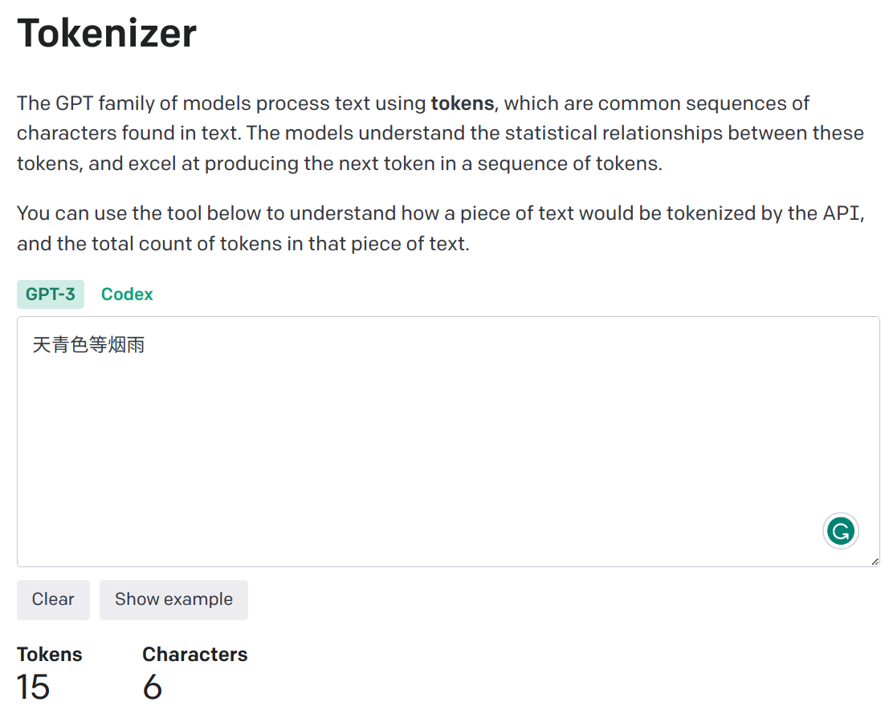

#### 分词（Tokenize） 介绍
[参考](https://zhuanlan.zhihu.com/p/448147465)
- 语言模型是对文本进行推理。由于文本是字符串，但对模型来说，输入只能是数字，所以就需要将文本转成用数字来表达。最直接的想法，就是类似查字典，构造一个字典，包含文本中所有出现的词汇，比如中文，可以每个字作为词典的一个元素，构成一个列表；一个句子就可以转换成由每个词的编号（词在词典中的序号）组成的数字表达。分词就是将连续的字序列按照一定的规范重新组合成语义独立词序列的过程，一个分词示例流程如下：
  - Hello Geeks how are you 的一句话分开为每个单词为一个 token： [Hello, Geeks, how, are, you]
  - 执行分词的算法模型称为分词器（Tokenizer） ，划分好的一个个词称为 Token，这个过程称为 Tokenization
  - 由于一篇文本的词往往太多了，为了方便算法模型训练，我们会选取出频率 （也可能是其它的权重）最高的若干个词组成一个词表（Vocabulary）

- 古典分词方法
  - 具体分词方式示例
    - 直接把词与词直接加一个空格
    - 按标点符号分词
    - 语法规则分词
  - 缺点
    - 对于未在词表中出现的词（Out Of Vocabulary, OOV ），模型将无法处理（未知符号标记为 [UNK]）。
    - 词表中的低频词/稀疏词在模型训无法得到训练（因为词表大小有限，太大的话会影响效率）
    - 很多语言难以用空格进行分词，例如英语单词的多形态，"look"衍生出的"looks", "looking", "looked"，其实都是一个意思，但是在词表中却被当作不同的词处理，模型也无法通过 old, older, oldest 之间的关系学到 smart, smarter, smartest 之间的关系。这一方面增加了训练冗余，另一方面也造成了大词汇量问题。

- 拆分为单个字符（Character embedding）
  - 是一种更为极端的分词方法，直接把一个词分成一个一个的字母和特殊符号。虽然能解决 OOV 问题，也避免了大词汇量问题，但缺点也太明显了，粒度太细，训练花费的成本太高

- 基于子词的分词方法（Subword Tokenization）
  - 把一个词切成更小的一块一块的子词，**基于子词的分词方法是目前主流的分词方案**，有点类似英语中的词根词缀拼词法，其中的这些小片段又可以用来构造其他词。可见这样做，既可以降低词表的大小，同时对相近词也能更好地处理
    - 例如：“unfortunately ” = “un ” + “for ” + “tun ” + “ate ” + “ly ”
  - 三种主流的 Subword 算法，它们分别是：Byte Pair Encoding (BPE)、WordPiece 和 Unigram Language Model

#### 字节对编码 Byte Pair Encoding (BPE)、WordPiece、Unigram Language Model 介绍
[参考1](https://zhuanlan.zhihu.com/p/448147465), [参考2](https://zhuanlan.zhihu.com/p/86965595)
- 字节对编码（BPE, Byte Pair Encoder），又称 digram coding 双字母组合编码，是一种数据压缩 算法，用来在固定大小的词表中实现可变⻓度的子词。该算法简单有效，因而目前它是最流行的方法。
  - BPE 首先将词分成单个字符，然后依次用另一个字符替换频率最高的一对字符 ，直到循环次数结束。
  - 算法过程
    1. 准备语料库，确定期望的 subword 词表大小等参数
    2. 通常在每个单词末尾添加后缀 `</w>`，统计每个单词出现的频率，例如，low 的频率为 5，那么我们将其改写为 "l o w `</ w>`"：5
    注：停止符 `</w>` 的意义在于标明 subword 是词后缀。举例来说：st 不加 `</w>` 可以出现在词首，如 st ar；加了 `</w>` 表明该子词位于词尾，如 we `st</w>`，二者意义截然不同
    3. 将语料库中所有单词拆分为单个字符，用所有单个字符建立最初的词典，并统计每个字符的频率，本阶段的 subword 的粒度是字符
    4. 挑出频次最高的符号对 ，比如说 t 和 h 组成的 th，将新字符加入词表，然后将语料中所有该字符对融合（merge），即所有 t 和 h 都变为 th。
    注：新字符依然可以参与后续的 merge，有点类似哈夫曼树，BPE 实际上就是一种贪心算法 。
    5. 重复遍历 2 和 3 操作，直到词表中单词数达到设定量 或下一个最高频数为 1 ，如果已经打到设定量，其余的词汇直接丢弃
  - BPE 一般适用在欧美语言拉丁语系中，因为欧美语言大多是字符形式，涉及前缀、后缀的单词比较多。而中文的汉字一般不用 BPE 进行编码，因为中文是字无法进行拆分。对中文的处理通常只有分词和分字两种。理论上分词效果更好，更好的区别语义。分字效率高、简洁，因为常用的字不过 3000 字，词表更加简短。

- WordPiece：WordPiece算法和BPE类似，区别在于WordPiece是基于概率生成新的subword而不是下一最高频字节对。- Unigram：它和 BPE 等一个不同就是，bpe是初始化一个小词表，然后一个个增加到限定的词汇量，而 Unigram 是先初始一个大词表，接着通过语言模型评估不断减少词表，直到限定词汇量。

#### ChatGPT 的 tokenizer 用于中文分词的问题
[参考](https://zhuanlan.zhihu.com/p/626621158)

- 在 [Openai Tokenizer demo](https://platform.openai.com/tokenizer) 中，中文分词后的 token 数量远大于原始中文字符数目
	

 

- 原因剖析：OpenAI 为了支持多种语言的 Tokenizer，采用了文本的一种通用表示：UTF-8 的编码方式，这是一种针对 Unicode 的可变长度字符编码方式，它将一个 Unicode 字符编码为1到4个字节的序列。

#### 为什么 llama 的 tokenizer 需要单独针对中文语料进行词表扩充
- 百川2的技术报告中提到过 tokenizer 的设计需要考虑两个重要因素：
  - 高压缩率：以实现高效的推理
  - 适当大小的词汇表：以确保每个词嵌入的充分训练
- 因为原生LLaMA对中文的支持很弱，tokenizer 中的中文字符和词汇较少，导致一个中文汉字往往被切分为多个 token，不满足上面所提到的高压缩率原则，所以需要进行词表扩充