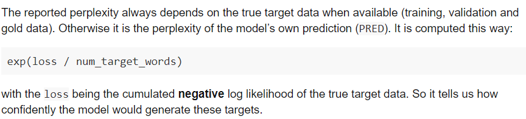

#### 困惑度 (perplexity) 介绍
[参考1](https://paddlepedia.readthedocs.io/en/latest/tutorials/deep_learning/metrics/perplexity.html)，[参考2](https://zhuanlan.zhihu.com/p/44107044), [参考3](https://zhuanlan.zhihu.com/p/114432097)

- 困惑度定义
  - Perplexity，中文翻译为困惑度，是信息论中的一个概念，其可以用来衡量一个随机变量的不确定性，也可以用来衡量模型训练的好坏程度。通常情况下，一个随机变量的Perplexity数值越高，代表其不确定性也越高；一个模型推理时的Perplexity数值越高，代表模型表现越差，反之亦然。
- 计算方式：
  - 对于句子s（词语w的序列）
  $S = W_{1}, W_{2},...,W_{k}$
  - 它的概率为 $P(S) = P(W_{1}, W_{2}, ..., W_{k}) = p(W_{1})P(W_{2}|W_{1})...P(W_{k}|W_{1},W_{2},...,W_{k-1})$
  - 困惑度与测试集上的句子概率相关，其基本思想是：给测试集的句子赋予较高概率值的语言模型较好,当语言模型训练完之后，测试集中的句子都是正常的句子，那么训练好的模型就是在测试集上的概率越高越好，公式如下:
  $Perplexity(W)=P(w_{1}w_{2}...w_{N})^{-\frac{1}{N}}=\sqrt[N]{\frac{1}{P(w_{1}w_{2}...w_{N})}}$
  - 从上面公式可以分析得到：句子越好（概率大），困惑度越小，也就是模型对句子越不困惑。
- 语言模型中的使用：perplexity可以从cross entropy中得到，而cross entropy又是除了语言模型以外的文本生成任务（如机器翻译，摘要生成等）也常用的loss，所以我们也可以把perplexity拓展到语言模型外，用cross entropy来计算文本生成里的困惑度。机器翻译的框架OpenNMT就使用了困惑度作为一个指标：
  	
 
 	 	 	 	 	  
 	 	 	 	 
 

