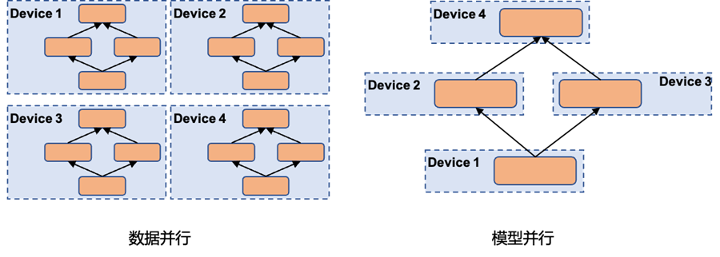
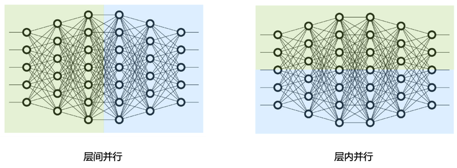
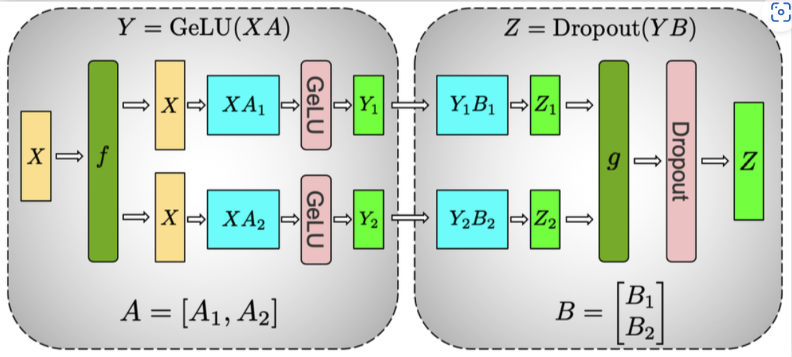
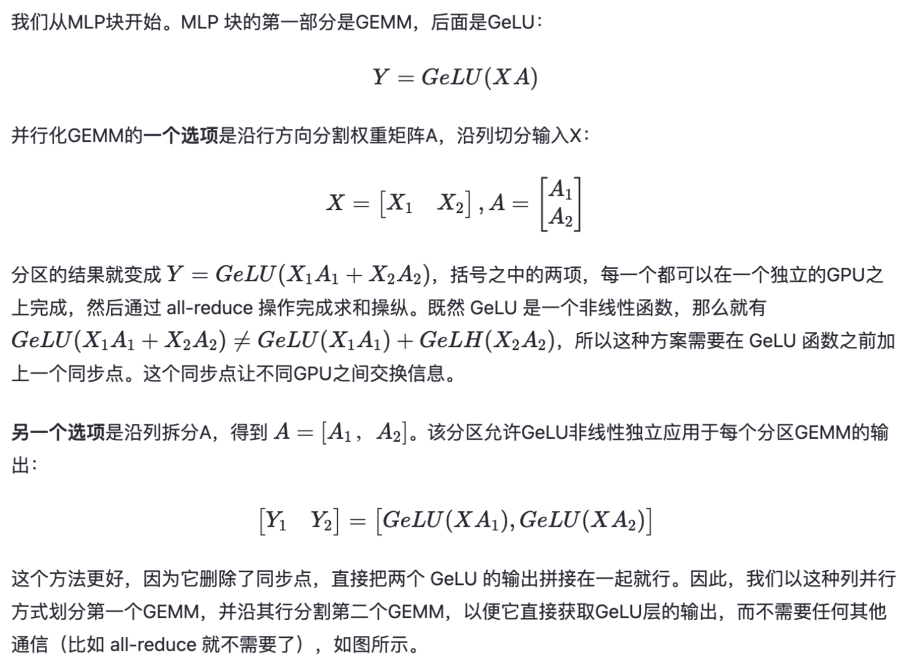

#### Megatron-lm 介绍

[参考1](https://arxiv.org/abs/1909.08053), [参考2](https://www.bilibili.com/video/BV1nB4y1R7Yz/?spm_id_from=333.880.my_history.page.click&vd_source=4485ae5d861b0e733e8796b93c824c9e), [参考3](https://huggingface.co/blog/zh/megatron-training), [参考4](https://blog.csdn.net/zwqjoy/article/details/132507636), [参考5](https://www.paddlepaddle.org.cn/support/news?action=detail&id=2913)

- NVIDIA 出品的 Megatron-LM 是一个基于 PyTorch 的分布式训练框架，用来训练基于 Transformer 的大型语言模型。Megatron-LM 综合应用了数据并行（Data Parallelism），张量并行（Tensor Parallelism）和流水线并行（Pipeline Parallelism）来复现 GPT-3.

- 【背景】
  - 随着计算资源的普及和数据集的增大，模型参数的数量呈指数级增长。然而，训练这样规模庞大的模型面临着一些挑战：
    - **显存限制**： 即便是目前最大的GPU主内存也难以容纳这些模型的参数。举例来说，一个1750亿参数的GPT-3模型需要约700GB的参数空间，对应的梯度约为700GB，而优化器状态还需额外的1400GB，总计需求高达2.8TB。
    - **计算挑战**： 即使我们设法将模型适应单个GPU（例如通过在主机内存和设备内存之间进行参数交换），模型所需的大量计算操作也会导致训练时间大幅延长。举个例子，使用一块NVIDIA V100 GPU来训练拥有1750亿参数的GPT-3模型，大约需要耗时288年。
    - **并行策略挑战**： 不同的并行策略对应不同的通信模式和通信量，这也是一个需要考虑的挑战。

- 并行策略介绍：其中张量并行和流水线并行属于模型并行范畴
  - **数据并行 (DP)**: 数据并行模式会在每个worker之上复制一份模型，这样每个worker都有一个完整模型的副本。输入数据集是分片的，一个训练的小批量数据将在多个worker之间分割；worker定期汇总它们的梯度，以确保所有worker看到一个一致的权重版本
  - **张量并行 (TP)**: 把某一个层做切分，放置到不同设备之上，也可以理解为把矩阵运算分配到不同的设备之上，比如把某个矩阵乘法切分成为多个矩阵乘法放到不同设备之上。
  - **流水线并行 (PP)**: 把模型不同的层放到不同设备之上，比如前面几层放到一个设备之上，中间几层放到另外一个设备上，最后几层放到第三个设备之上。

#### TP 和 PP 通信对比
[参考](https://blog.csdn.net/zwqjoy/article/details/132507636)
- 通信方式：
  - 流水线并行 (PP)：通信在流水线阶段相邻的切分点之上，通信类型是P2P通信，单次通信数据量较少但是比较频繁，而且因为流水线的特点，会产生GPU空闲时间，这里称为流水线气泡（Bubble）
  - 张量并行 (TP)：通信发生在每层的前向传播和后向传播过程之中，通信类型是 all-reduce，不但单次通信数据量大，并且通信频繁。
- 通信设备：张量并行一般都在同一个机器之上，所以通过 NVLink 来进行加速，对于流水线并行，一般通过 Infiniband 交换机进行连接。

#### MLP 的切分为什么 A 采用列切割，B采用行切割？
[参考](https://blog.csdn.net/zwqjoy/article/details/132507636)

#### DDP 具体原理介绍, Ring-AllReduce 原理？
[参考1](https://zhuanlan.zhihu.com/p/617133971), [参考2](https://zhuanlan.zhihu.com/p/504957661)
- 分布式数据并行，采用Ring AllReduce的通讯方式，实际中多用于多机场景
  - 受通讯负载不均的影响，DP一般用于单机多卡场景。因此，DDP作为一种更通用的解决方案出现了，既能多机，也能单机。DDP首先要解决的就是通讯问题：将Server上的通讯压力均衡转到各个Worker上。实现这一点后，可以进一步去Server，留Worker。
  - Ring-AllReduce 通过定义网络环拓扑的方式，将通讯压力均衡地分到每个GPU上，使得跨机器的数据并行（DDP）得以高效实现。
    - 实现分为两个步骤: Reduce-Scatter和All-Gather
  - DP和DDP的总通讯量相同，但因负载不均的原因，DP需要耗费更多的时间搬运数据

#### DeepSpeed 介绍
[参考](https://zhuanlan.zhihu.com/p/513571706)

- DeepSpeed的核心是ZeRO(Zero Redundancy Optimizer)，简单来说，它是一种显存优化的数据并行(data parallelism, DP)方案。在过去两年DeepSpeed团队发表了三篇ZeRO相关的论文，提出了去除冗余参数、引入CPU和内存、引入NVMe等方法，从始至终都围绕着一个目标：将显存优化进行到底。

- ZeRO将模型训练阶段，每张卡中显存内容分为两类：
  - 模型状态（model states）: 模型参数（fp16）、模型梯度（fp16）和Adam状态（fp32的模型参数备份，fp32的momentum和fp32的variance）。假设模型参数量
 $\Phi$， 则共需要 $2\Phi+2\Phi+(4\Phi+4\Phi+4\Phi)=16\Phi$ 字节存储，可以看到，Adam 状态占比 75%。
  - 剩余状态（residual states）: 除了模型状态之外的显存占用，包括激活值（activation）、各种临时缓冲区（buffer）以及无法使用的显存碎片（fragmentation）。
  - 来看一个例子，GPT-2含有1.5B个参数，如果用fp16格式，只需要3GB显存，但是模型状态实际上需要耗费24GB！