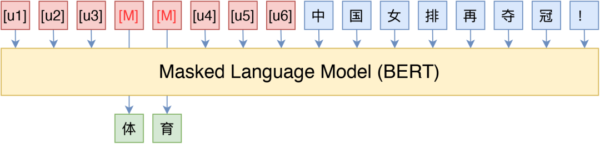

#### Pattern-Exploiting Training（PET）
[参考](https://mp.weixin.qq.com/s?__biz=MzIwMTc4ODE0Mw%3D%3D&chksm=96ea6fe7a19de6f1be86b965e268df1b9c6320810cf32b6d64ddd3d238bf9088be41fb36adfe&idx=1&mid=2247512167&scene=21&sn=cc7695d92362e3b18a6e8969fb14dc27#wechat_redirect)
- 它通过人工构建的模版与 BERT 的 MLM 模型结合，能够起到非常好的零样本、小样本乃至半监督学习效果，而且该思路比较优雅漂亮，因为它将预训练任务和下游任务统一起来了

#### P-tuning
[参考1](https://arxiv.org/pdf/2103.10385.pdf), [参考2](https://blog.csdn.net/c9Yv2cf9I06K2A9E/article/details/115648821)
- P-tuning（GPT Understands, Too）
  - P-tuning 重新审视了关于模版的定义，放弃了“模版由自然语言构成”这一常规要求，从而将模版的构建转化为连续参数优化问题，虽然简单，但却有效
  - P-tuning直接使用[unused*]的token来构建模版，不关心模版的自然语言性
    	

 	 	 	 	 	 
 	 	 	 	 

#### LoRA

[参考1](https://zhuanlan.zhihu.com/p/617211910)，[参考2](https://zhuanlan.zhihu.com/p/643560888#:~:text=%E4%BB%BB%E5%8A%A1%E4%B8%AD%E7%9A%84%E6%8C%91%E6%88%98-,7.Lora%E7%9A%84%E5%8E%9F%E7%90%86%E5%92%8C%E5%AD%98%E5%9C%A8%E7%9A%84%E9%97%AE%E9%A2%98%E8%AE%B2%E4%B8%80%E4%B8%8B%EF%BC%9F,-%E5%89%8D%E9%9D%A2%E5%9C%A84)
- 低秩自适应 (Low-Rank Adaptation, LoRA)：冻结了预训练的模型权重，并将可训练的秩分解矩阵注入到 Transformer 架构的每一层，极大地减少了下游任务的可训练参数的数量，有效提升预训练模型在下游任务上的 finetune 效率
    	

 	 	 	 	 	 
 	 	 	 	 

- 【背景】之前的 PEFT 方法是 adapter/prefix/promp/P-tuning，但是Adapter会引入很强的推理延迟（只能串行），prefix/prompt/P-tuning很难练，而且要占用context length，变相的降低模型能力
- 【详解】具体来说，就是考虑到语言模型（LLM 尤其如此）的参数的低秩属性（low intrinsic dimension），或者说过参数化，在做 finetune 的时候不做 full-finetune，而是用一个降维矩阵A和一个升维矩阵B去做finetune。如果我们认为原来的模型的某个参数矩阵为  $W_{0}$，那么可以认为原来经过全微调的参数矩阵为 $W_{0} + \Delta(W)$ ，但考虑到前面的低秩属性，在 lora 中我们可以简单认为  $\Delta(W)=BA$  (B 是降维矩阵，A是升维矩阵，其中 A 正常随机数初始化，**B 全 0 初始化**，从而保证训练初期的稳定性)，其中 BA 的秩相当于是你认为的模型实际的秩。这样的话在做推理的时候， $h=W_{0}x + BAx$ ，根本不会引入推理延迟，因为你只需要把训好的 lora 参数 $AB$ 加进模型初始权重 $W_{0}$ 中就可以了。在 Transformer 中 self-attention 和 mlp 模块都有对应的 params 矩阵，对应加上 lora 即可。
  - llama 为了节省参数量一般只加在 q、v 上 ([参考](https://github.com/tloen/alpaca-lora/blob/main/finetune.py#L44))，原论文实验是不会掉点
  - bloom 一般加在 q、k、v 上