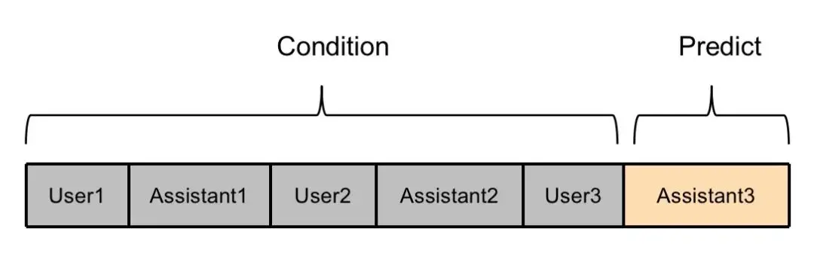
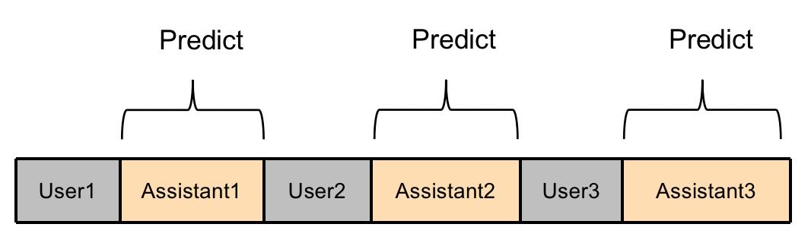

#### SFT 训练如何提升训练效率
- 数据去重降低重复数据带来的计算量：基于正则匹配，minhash 等算法
- 训练语料中多条 concat 为一条，使不同 batch 的语料 token 数目基本一致，从而降低 padding 对计算效率的影响
- 使用 bf16 数值类型代替 fp32 数值类型
- 测试训练效率最高的 DP/TP/PP 参数
- freeze transformer 模型的底层参数

#### 多轮对话数据如何计算损失
[参考](https://zhuanlan.zhihu.com/p/647733151)
- ChatGLM2的多轮对话训练方式如下图所示，只有最后一轮对话内容参与计算loss，其他的Assistant回复内容不参与计算loss，训练数据利用不充分，造成浪费。

- ChatGLM2 多轮训练优化方式如下，训练时，多轮对话中的每个回复都被充分利用：

