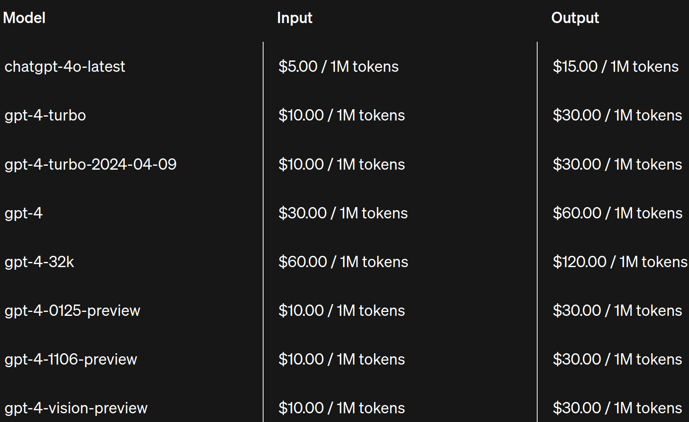

#### 为什么 LLM 输出 token 的价格比输入 token 高？
参考： [为什么 output token 的价格比 input token 更贵？](https://blog.csdn.net/sinat_37574187/article/details/141125155), [大模型output token为什么比input token贵？](https://juejin.cn/post/7403655505716690978), [为什么使用大模型API时，output token 的价格比 input token 更贵？](https://blog.csdn.net/qq_59084968/article/details/141164377)
- 从以下 OpenAI API 价格表中可以看出，output token 的价格比 input token 的价格要高，一般 output token 的价格是 input token 的 2-4 倍。

- 在 KV cache（键值缓存）的支持下，大模型生成 token 分为两个阶段：
  - 预填充（prefill）
    - 在预填充阶段，模型会并行处理输入的 prompt（即 input token），生成 KV cache。这一步骤包括一次完整的前向传播（forward），并输出第一个 token。这个过程的时间主要由 input token 决定，因为它们需要进行一次全面的计算来初始化整个生成过程。
  - 解码（decoding）
    - 解码阶段是逐个生成下一个 token 的过程。在这一步中，output token 的数量决定了需要进行多少次前向传播。虽然每次前向传播由于 KV cache 的存在而更快，但这仍然需要模型多次计算，逐步生成每一个后续的 token。

- 计算量和内存角度来看 input token 与 output token 差异不大
  - 从计算量的角度来看，对于输入的 D 个 token，和输出 D 个token来说，FLOPs 都大约是 2ND，其中 N 为参数量。至于为什么 FLOPs 为什么是 2ND， 可以看这篇：[学妹问：“反向传播的计算量是前向传播计算量的几倍？”](https://mp.weixin.qq.com/s?__biz=MzUyOTA5OTcwMg==&mid=2247486124&idx=1&sn=c9294e6696047bb616e0f640fca3ff5f&chksm=fa677475cd10fd63f99450f3d6d1287e79a38a3a99eeee28515e84c0e982d745e7d51a4ac65f&scene=21#wechat_redirect)。
  - 从内存角度来看，输入 token 和 QKV 等矩阵大小和 输出 token 的也差不太多，只不过输出 token 采用 KV Cache 的形式。
- input token 与 output token 成本差异原因是资源利用率不同
  - 既然计算量和内存占用都差不多，从资源的角度来讲，成本是差不多的。那最终成本究竟差在哪里呢？其实是差在资源的利用率上。要知道 GPU 在运算的时候，既有计算，又有数据通信。这就存在一个最佳的 ops:bytes ratio。通俗点来讲，就是每读取一份数据 (比如一个 FP16/BF16)， 应该执行多少 FLOPs。如果算的比读的快，那通信就是瓶颈，因为这个时候 GPU 的 SM 在等待。如果算的比读的慢，那计算就是瓶颈，这个时候通信需要等待。大模型训练，大多数情况下，通信是瓶颈，所以都是算的快，读的慢。这样计算下来，整体的 MFU (Model FLOPs utilization) 很难打满。经过这么长时间的优化，目前大模型的训练 MFU 在50-60% 就已经很厉害了。
  - **对于 D 个输入 token 来说，模型只需要执行一个 forward 计算，可以充分的并行，整个计算过程的利用率能接近训练的最高水平。然而对于 输出 token 来说，必须是一个 token 一个 token 的生成，对于 D 个输出 token 来说，需要执行 D 次 forward 操作**。本来通信就是瓶颈，现在 D 次 forward 的额外通信更是雪上加霜。虽然现在也有batch 上，还有动态填充等优化，但是 GPU 利用率上来说，输出是远低于输入的。
